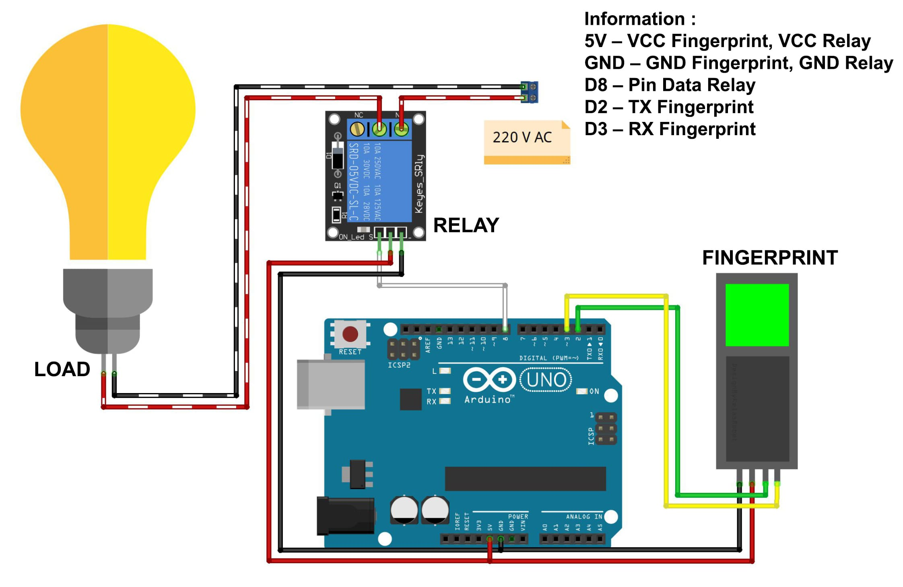

# Fingerprint Sensor Relay Control with Arduino

This project demonstrates the integration of an Adafruit optical fingerprint sensor with an Arduino to control a relay module. The system identifies registered fingerprints and toggles a relay to control an external device, such as a light.

## Components Used

- Arduino IDE or Text Editor (VS Code Studio);
- Arduino Uno (or compatible board) = 1 Unit;
- Adafruit Optical Fingerprint Sensor = 1 Unit;
- Relay 1 Channel Module = 1 Unit;
- Resistors;
- Project Board / Breadboard.
- Jumper Wires.

# Schematic:

- Below you can see a schematic image to facilitate the wiring of cables from the microcontroller to devices, both input and output sensors:

## Wiring Diagram

- **Fingerprint Sensor:**
  - White wire (TX) to Arduino D2
  - Green wire (RX) to Arduino D3
  - Power (VCC) to 5V
  - Ground (GND) to GND
- **Relay Module:**
  - Control pin to Arduino D8
  - VCC to 5V
  - GND to GND

## Work steps

- Prepare the tools and materials to be used.
- Carry out the wiring process using Figure schematic of the above circuit.
- Open the Arduino IDE software that has been installed on laptop/computer.
- Download all the libraries above and insert the libray by opening the Arduino IDE, selecting Sketch > Include Library -> Add.Zip Library.
- Type the sketch program on the Arduino IDE page.
- Carry out the program uploading process.

## How It Works

- The fingerprint sensor is connected to the Arduino via software serial, using pins D2 and D3.
- When a fingerprint is detected and matched, the relay's state is toggled. This can be used to control devices such as lights, motors, or other electronics.
- The system continuously checks for valid fingerprints and updates the relay status accordingly.

## Code Explanation

- The `Adafruit_Fingerprint` library is used to interface with the fingerprint sensor.
- The program continuously scans for fingerprints, and when a match is found, it toggles the relay's state.
- The relay is connected to pin D8, and its state is controlled within the `cek_relay()` function.

## Installation

1. Download and install the [Adafruit Fingerprint Sensor library](https://github.com/adafruit/Adafruit-Fingerprint-Sensor-Library) from the Arduino Library Manager.
2. Connect the components as described in the wiring diagram.
3. Upload the provided code to your Arduino using the Arduino IDE.

## Usage

- Power on the system, and place a registered finger on the sensor.
- If a match is found, the relay will toggle its state, turning the connected device on or off.
- The system prints messages to the serial monitor to indicate the current status.

## Conclusion:

- Before the program works, make sure we have fingerprints registered to register fingerprints so they are on the material "How to Register Fingerprints on a Fingerprint Sensor". Once the fingerprint is registered, try accessing fingerprints. If the light is on then the program is working well.

#### @Copyright 2024 | TurningOn-The-Home-Lights-with-Fingerprint
